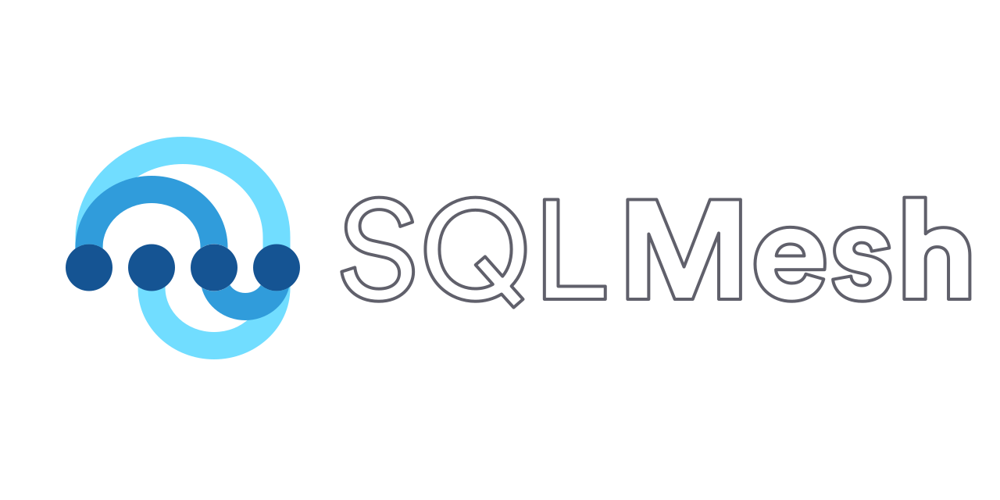

SQLMesh is a data transformation framework that brings the benefits of DevOps to data teams. It enables data scientists, analysts, and engineers to efficiently run and deploy data transformations written in SQL or Python.

If you're new to SQLMesh, it may be helpful to walk through the quickstart guide before working with the SQLMesh example project.

For more information, check out the [website](https://sqlmesh.com) and [documentation](https://sqlmesh.readthedocs.io/en/stable/).

## Example projects

This repository contains standalone example SQLMesh projects for you to tinker with, test, and break. The examples vary in size and complexity, demonstrating different SQLMesh features and options.

Each example directory contains a Jupyter notebook (`.ipynb` file) that walks through the project's contents and describes notable features. The notebook file is not necessary to run/use the example project and can be deleted.

SQLMesh projects require data to transform, and each project uses a local DuckDB database to store its data. The databases are not stored in the Github repository - the projects each contain a Python file with helper functions for creating the data.

The functions can also add data to the database on demand, which is useful for simulating real-world scenarios where new data are ingested over time. Each helper file defines a command line interface, so the functions may be called from the CLI or by importing and calling them in Python (as the notebook files do).

## How to use this repository

### Setup

Using the example projects requires: cloning this Git repository and installing SQLMesh.

To clone the repository, first ensure that Git is installed on your computer. Then, locate repo URL/SSH info in this section of the Github site:

[SCREENSHOT]

In your command line interface (CLI), navigate to the folder where you want the `sqlmesh-examples` directory to be placed. Issue the `git clone <repo URL/SSH>` command to create a copy of the repo on your machine:

[SCREENSHOT]

Next, navigate to the `sqlmesh-examples` directory in your CLI. We recommend creating a Python virtual environment with the command `python -m venv .venv`, then activating it with the command `source .venv/bin/activate`:

[SCREENSHOT]

Install SQLMesh using `pip` with the command `pip install sqlmesh`. If you want to use the browser UI, include the extra dependencies with `pip install "sqlmesh[web]"`:

[SCREENSHOT]

If you want to use the Jupyter notebook walkthroughs, install Jupyter with the command `pip install notebook`:

[SCREENSHOT]

Navigate to the directory for one of the projects, and you are ready to go!

### Explore SQLMesh

After navigating to a project directory, you can open the project in the SQLMesh user interface with the `sqlmesh ui` command, work from the CLI with commands like `sqlmesh plan`, or open the notebook by issuing the `jupyter notebook` command and opening the notebook in your browser.

Have fun!
