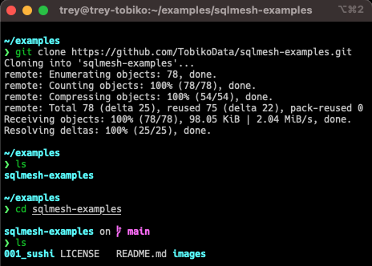
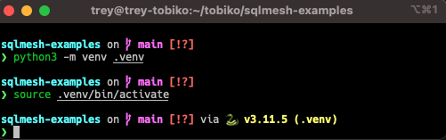

SQLMesh is a data transformation framework that brings the benefits of DevOps to data teams. It enables data scientists, analysts, and engineers to efficiently run and deploy data transformations written in SQL or Python.

If you're new to SQLMesh, it may be helpful to walk through the [quickstart guide](https://sqlmesh.readthedocs.io/en/stable/quick_start/) before working with the SQLMesh example project.

For more information, check out the [website](https://sqlmesh.com) and [documentation](https://sqlmesh.readthedocs.io/en/stable/).

## Example projects

This repository contains standalone example SQLMesh projects for you to tinker with, test, and break. The examples vary in size and complexity, demonstrating different SQLMesh features and options.

Each set of example projects contains a Jupyter notebook (`.ipynb` file) that walks through the project's contents and describes notable features. The notebook file is not necessary to run/use the example project and can be deleted. You can view a rendered notebook in Github if you do not want to run it locally (e.g., the [sushi project overview notebook](https://github.com/TobikoData/sqlmesh-examples/blob/main/001_sushi/sushi-overview.ipynb)).

### Project data

SQLMesh projects require data to transform, and each project uses a local DuckDB database to store its data. Each example contains a database with a small amount of data so the projects will run out of the box.

The projects each contain a Python file with helper functions that add data to the database, which is useful for simulating real-world scenarios where new data are ingested over time. Each helper file defines a command line interface, so the functions may be called from the CLI or by importing and calling them in Python (as the overview notebook files do).

## How to use this repository

Running the examples requires three steps:

1. Clone/download this git repository
2. Install SQLMesh
3. Execute the projects

### Setup

Running the example projects requires cloning this Git repository and installing Python libraries.

To clone the repository, first ensure that Git is installed on your computer. In your command line interface (CLI), navigate to the folder where you want the `sqlmesh-examples` directory to be placed. Issue the `git clone https://github.com/TobikoData/sqlmesh-examples.git` command to create a copy of the repo on your machine:



Next, navigate to the `sqlmesh-examples` directory in your CLI. We recommend creating a Python virtual environment with the command `python3 -m venv .venv`, then activating it with the command `source .venv/bin/activate`:



Running the examples requires a few different Python libraries:
- SQLMesh (including web UI dependencies if you want to use the graphical interface) [required to do anything]
- Jupyter notebooks [required to run overview notebooks]

Install only the necessary libraries:

```pip install sqlmesh```

Or install all the libraries:

 ```pip install "sqlmesh[web]" notebook```

Navigate to the directory for one of the example projects, and you are ready to go!

### Explore SQLMesh

After navigating to a project directory, you can open the project in the SQLMesh user interface with the `sqlmesh ui` command, work from the CLI with commands like `sqlmesh plan`, or open a notebook by issuing the `jupyter notebook` command (or using an IDE like VSCode's native notebook functionality).

Have fun!
